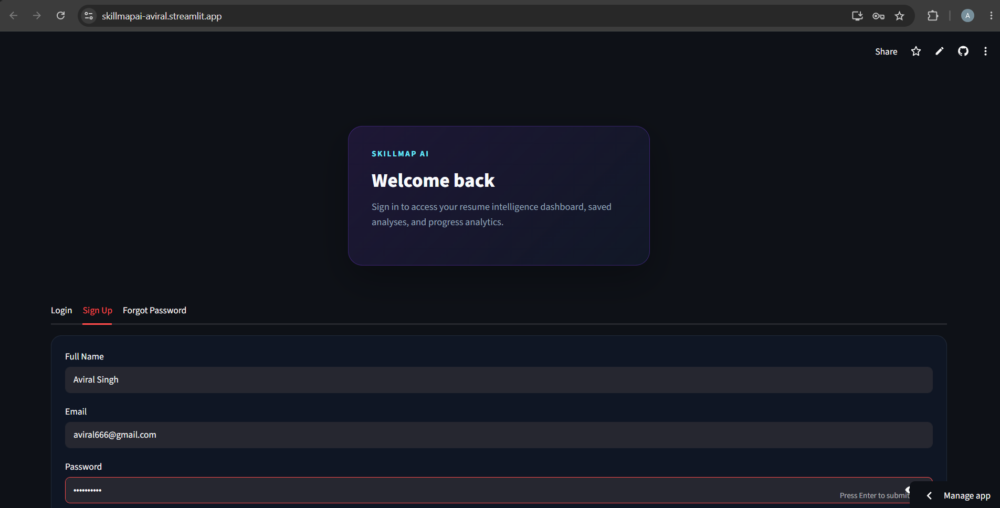
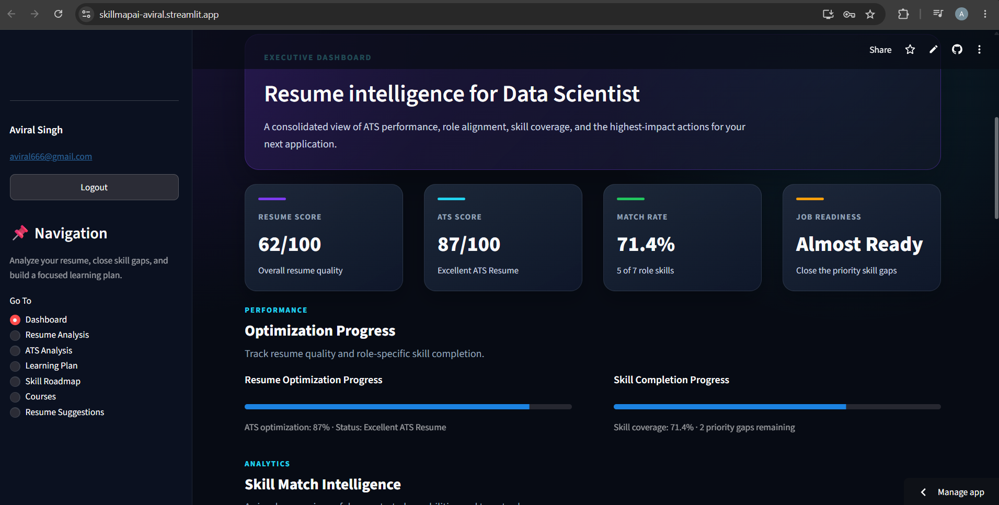
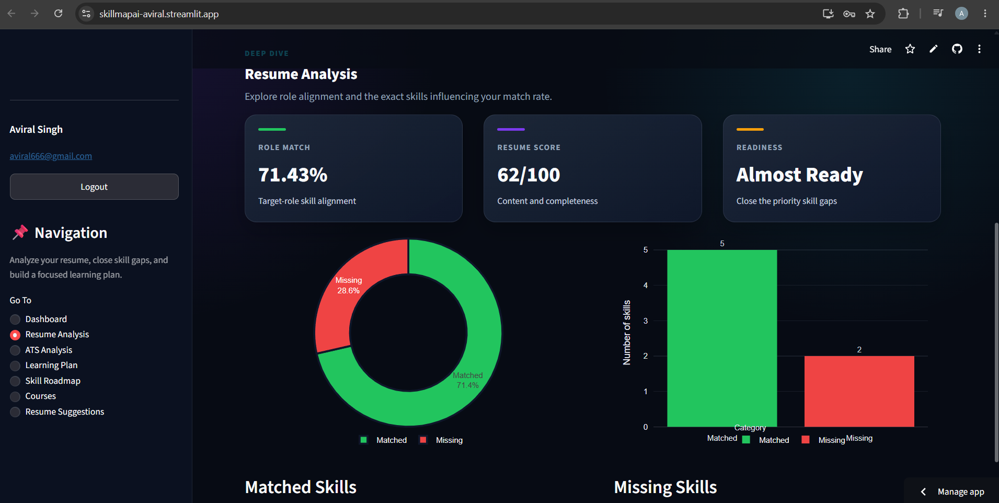
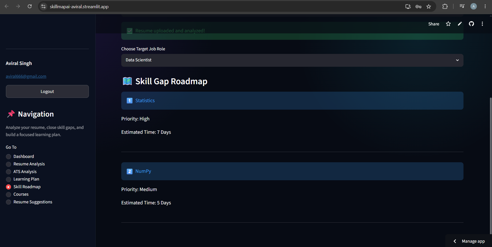
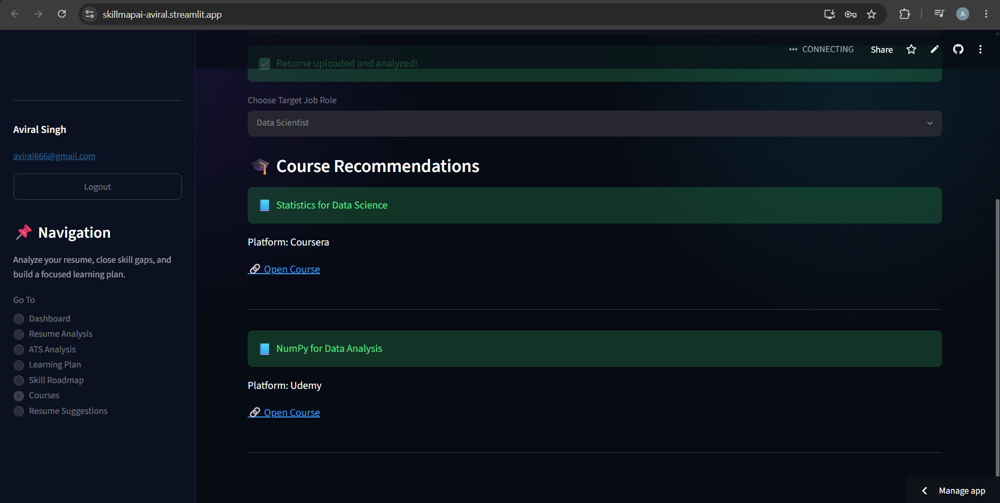
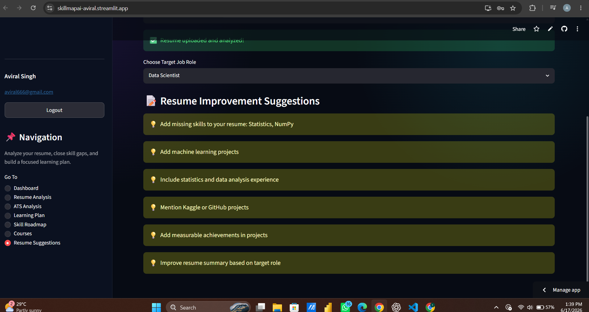

# SkillMap AI


SkillMap AI is an AI-powered Resume Intelligence Platform that helps students, freshers, and job seekers analyze resumes, calculate ATS compatibility scores, identify skill gaps, and generate personalized learning roadmaps.

The platform combines Resume Analysis, ATS Evaluation, Skill Gap Intelligence, Learning Recommendations, and Career Development Insights into a single dashboard.

---

# 🎯 Problem Statement

Many students and freshers struggle to understand whether their resumes are ATS-friendly and what skills they need to become job-ready.

SkillMap AI solves this problem by combining resume analysis, ATS evaluation, skill-gap detection, learning recommendations, and career roadmaps into a single platform.

---

# 🌐 Live Demo

### 🚀 Launch Application

👉 https://skillmapai-aviral.streamlit.app

### Demo Access

* Create your own account using **Sign Up**
* No admin credentials required
* Secure authentication powered by Firebase

---

# 🔑 Getting Started

### New Users

1. Open the application
2. Click **Sign Up**
3. Enter:

   * Full Name
   * Email Address
   * Password (minimum 6 characters)
4. Click **Create Account**
5. Login using your newly created credentials

### Existing Users

1. Click **Login**
2. Enter your registered email and password
3. Click **Sign In**

### Forgot Password

1. Open the **Forgot Password** tab
2. Enter your registered email
3. Click **Send Reset Link**
4. Follow the instructions sent to your email

---

# 📝 How To Use

### Step 1: Login

Create an account or sign in using Firebase Authentication.

### Step 2: Upload Resume

Upload your resume in PDF format.

Supported format:

* PDF (.pdf)

### Step 3: Resume Processing

SkillMap AI automatically:

* Extracts resume text
* Identifies technical skills
* Evaluates resume quality
* Calculates ATS compatibility
* Generates resume insights

### Step 4: Review Analysis

Explore:

* Dashboard
* Resume Analysis
* ATS Analysis
* Learning Plan
* Skill Roadmap
* Course Recommendations
* Resume Suggestions

### Step 5: Improve Your Profile

Use the generated recommendations to:

* Increase ATS score
* Close skill gaps
* Build a learning roadmap
* Prepare for target job roles

---

# 🌟 Features

### 📄 Resume Analysis

* PDF Resume Upload
* Resume Text Extraction
* Resume Quality Assessment
* Resume Insights Generation

### 🎯 ATS Analysis

* ATS Score Calculation
* Keyword Optimization Suggestions
* Resume Improvement Recommendations
* ATS Compatibility Evaluation

### 🧠 Skill Gap Intelligence

* Skill Identification
* Missing Skill Detection
* Gap Analysis
* Career Readiness Evaluation

### 🛣 Learning Roadmap Generator

* Personalized Learning Paths
* Structured Skill Development
* Career Progress Tracking

### 📚 Course Recommendations

* Skill-Based Course Suggestions
* Learning Resource Recommendations
* Career-Oriented Upskilling Guidance

### 🔐 Authentication System

* Firebase Authentication
* User Registration
* Secure Login
* Password Reset
* Session Persistence

### ☁ Cloud Deployment

* Streamlit Cloud Hosting
* PostgreSQL (Neon) Integration
* Firebase Backend Services

---

# 🏗 Tech Stack

### Frontend

* Streamlit
* HTML
* CSS
* Plotly

### Backend

* Python

### Database

* PostgreSQL (Neon)

### Authentication

* Firebase Authentication

### Libraries & Tools

* SQLAlchemy
* Pandas
* PyMuPDF
* Plotly
* ReportLab
* Requests
* Python Dotenv
* Firebase Admin SDK

---

# 📂 Project Structure

```text
SkillMapAI/
│
├── frontend/
│   ├── app.py
│   ├── auth.py
│   └── firebase_config.py
│
├── services/
│   ├── ats_scorer.py
│   ├── course_recommender.py
│   ├── database_service.py
│   ├── firebase_service.py
│   ├── learning_recommender.py
│   ├── resume_parser.py
│   ├── roadmap_generator.py
│   └── skill_extractor.py
│
├── database/
│   ├── create_tables.py
│   ├── db_config.py
│   └── schema.sql
│
├── datasets/
│
├── .streamlit/
│   ├── config.toml
│
├── requirements.txt
├── README.md
└── .gitignore
```

---

# ⚙ Installation

### Clone Repository

```bash
git clone https://github.com/aviralsingh06/skillmapAI.git
cd skillmapAI
```

### Create Virtual Environment

```bash
python -m venv venv
```

### Activate Environment

Windows

```bash
venv\Scripts\activate
```

Linux / macOS

```bash
source venv/bin/activate
```

### Install Dependencies

```bash
pip install -r requirements.txt
```

---

# 🔥 Firebase Setup

Create a Firebase Project and enable:

* Authentication
* Email/Password Login

Configure:

```env
FIREBASE_API_KEY=
FIREBASE_PROJECT_ID=
FIREBASE_AUTH_DOMAIN=
FIREBASE_STORAGE_BUCKET=
```

Place your Firebase Service Account file:

```text
firebase-service-account.json
```

inside the project root directory.

---

# 🗄 Database Setup

Create a PostgreSQL database (Neon recommended).

Configure:

```env
DB_USER=
DB_PASSWORD=
DB_HOST=
DB_PORT=
DB_NAME=
```

Create database tables:

```bash
python database/create_tables.py
```

---

# ▶ Run Application

Start the application locally:

```bash
streamlit run frontend/app.py
```

Application URL:

```text
http://localhost:8501
```

---

# 📸 Screenshots

## 🔐 Authentication System

The application provides secure Firebase Authentication with Login, Signup, and Password Reset functionality.



---

## 📊 Dashboard Overview

Centralized dashboard displaying ATS Score, Resume Score, Skill Match Rate, Job Readiness, and overall resume intelligence metrics.



---

## 📄 Resume Analysis

Detailed resume evaluation with skill matching, missing skills identification, role alignment analysis, and interactive visualizations.



---

## 🗺 Skill Gap Roadmap

Personalized roadmap highlighting missing skills, priority levels, and estimated learning timelines to achieve career goals.



---

## 📚 Course Recommendations

AI-generated course recommendations mapped directly to identified skill gaps and target career roles.



---

## 💡 Resume Improvement Suggestions

Actionable recommendations to improve resume quality, ATS compatibility, project impact, and job readiness.



---


# 🎯 Future Enhancements

* AI Resume Rewriter
* Resume vs Job Description Matching
* Job Recommendation Engine
* LinkedIn Profile Analyzer
* AI Career Coach
* Interview Preparation Assistant
* Resume Version History
* Advanced Skill Benchmarking
* Multi-Role Resume Evaluation
* Industry-Specific Resume Templates

---

# 👨‍💻 Author

### Aviral Singh

B.Tech CSE (Data Science)
Sapthagiri NPS University

Passionate about Data Science, Artificial Intelligence, Machine Learning, and Software Development.

### Connect With Me

**LinkedIn**
https://www.linkedin.com/in/aviral-singh-a550a5325/

**GitHub**
https://github.com/aviralsingh06

---

# 📄 License

This project is licensed under the MIT License.

---

## ⭐ Support

If you found this project useful, consider giving it a star on GitHub.

It helps the project reach more students, developers, and recruiters.
